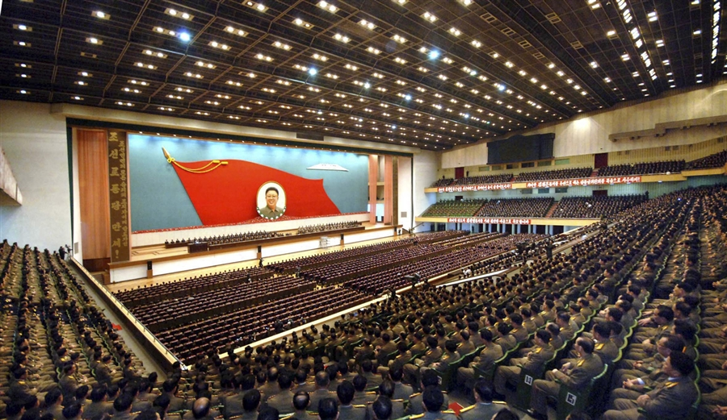

Las cosas se están poniendo difíciles en Corea del Norte, la situación bélica con Corea del Sur y Estados Unidos cada vez se siente más real.

Los militares estadounidenses realizaron una prueba en colaboración con Corea del Sur el pasado jueves, volando** bombarderos B-2 stealth** ejecutando bombardeos simulados. Estados Unidos hizo esto con intención de mostrar a Corea del Norte que están listo para apoyar a Corea del Sur si estos quisieran iniciar una guerra.

Cabe mencionar que Kim Jong-un ya ha ordenado a sus unidades estar listos para el ataque.

En estos momentos de tensión, es bueno tener a la disposición fuentes **rápidas** de información y nada mejor que** twitter** para esto.

Aquí te enlistamos 10 cuentas de twitter de personas que están completamente inundadas en la situación:

	- Steve Hermam
Photo of today's [#DPRK](https://twitter.com/search/%23DPRK) rally "to win the final life-and-death battle of national resistance against US imperialists." [twitter.com/W7VOA/status/3…](http://t.co/PtAlbO2A1x)

— Steve Herman (@W7VOA) [March 29, 2013](https://twitter.com/W7VOA/status/317601629945872385)

	- Jean H. Lee
My first tweet using [#Koryolink](https://twitter.com/search/%23Koryolink)'s new mobile [#Internet](https://twitter.com/search/%23Internet) service. Hello world from comms center in [#Pyongyang](https://twitter.com/search/%23Pyongyang).

— Jean H. Lee (@newsjean) [February 25, 2013](https://twitter.com/newsjean/status/305881828118642688)

	- Adam Cathcart
@[taniabranigan](https://twitter.com/taniabranigan) @[guardian](https://twitter.com/guardian) Six-part analysis of Korean conflict scenarios, quotes from Amb. James Hoare & myself [guardian.co.uk/world/2013/mar…](http://t.co/w2ruUXyt2H)

— Adam Cathcart (@adamcathcart) [March 29, 2013](https://twitter.com/adamcathcart/status/317687669612236800)

	- Alastair Gale
Shots of South Korean newspaper front pages this morning. The B-2 does make for a great photo. [twitter.com/AlastairGale/s…](http://t.co/Le4Go2rwJb)

— Alastair Gale (@AlastairGale) [March 29, 2013](https://twitter.com/AlastairGale/status/317446981750501376)

	- Aidan Foster-Carter
Koryo, Pioneer et al seem to be expanding tours into North Korea. So they can't be expecting war anytime soon. Just ignore that barking dog?

— Aidan Foster-Carter (@fcaidan) [March 28, 2013](https://twitter.com/fcaidan/status/317182813143179264)

	- Scott Snyder
Despite Kim Jong-un's threatdown, all is normal in downtown Seoul. [twitter.com/snydersas/stat…](http://t.co/xVYmv7KEdJ)

— Scott Snyder (@snydersas) [March 22, 2013](https://twitter.com/snydersas/status/314904316571959296)

	- Remco Breuker
South Korean and US approach to NK seems to be increasingly diverging. SK wants talks to remain option, US immediately sends out B-2s.

— Remco Breuker (@koryoinleiden) [March 29, 2013](https://twitter.com/koryoinleiden/status/317539299904065536)

	- Sangwon Yoon
[#Hagel](https://twitter.com/search/%23Hagel) Vows Support For [#SouthKorea](https://twitter.com/search/%23SouthKorea) After [#NorthKorea](https://twitter.com/search/%23NorthKorea)’s Threats [bloom.bg/14uJxYC](http://t.co/b6VagDDEsP) [#KimJongUn](https://twitter.com/search/%23KimJongUn)

— Sangwon Yoon (@sangwonyoon) [March 28, 2013](https://twitter.com/sangwonyoon/status/317087528396148738)

	- Max Fisher
Dennis Rodman, on his last day in North Korea, threw out his plane ticket and refused to leave. (He got talked down) [bit.ly/YIlCRw](http://t.co/RZ1NDv7QBt)

— Max Fisher (@Max_Fisher) [March 29, 2013](https://twitter.com/Max_Fisher/status/317650182122663936)

	- Joseph Ferris III
Q: "Is your country going to blow us all up? A: I'm American, so yes we have a history of such actions....

— Amer in North Korea (@JosephFerrisIII) [March 29, 2013](https://twitter.com/JosephFerrisIII/status/317442124901675008)

¿Qué opinas de esta guerra? ¿Crees que se lleve a cabo? No dejes de comentarnos. 

*La imagen de este post fue encontrada en: [NBC News](http://nbcnews.com)*
---

**Note about images**: This post originally contained images that are no longer available and will be replaced with similar images based on the context.

