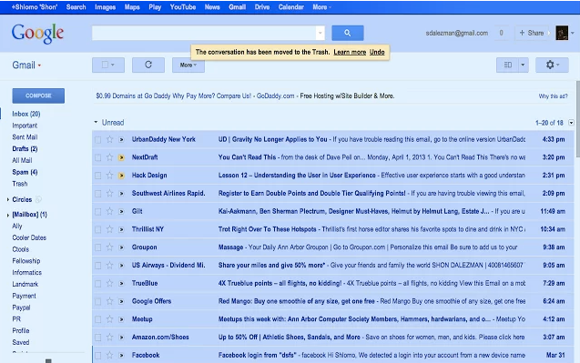

Si fuiste uno de los **tres millones** de personas que vieron el video del Gmail Blue y además te hubiera encantado que no sólo fuera una broma del April Fools, nuestro camarada [Shon Dalezman](http://www.shon-elysees.com/) se desveló haciendo [este](https://chrome.google.com/webstore/detail/gmail-blue/keiffooocjpcgkpojchelkgnjmmjlbgc) increíble plugin de Google Chrome que hará realidad la experiencia azulada de Gmail Blue.

Si no lo has visto, aquí te dejamos el vídeo:

http://www.youtube.com/watch?v=Zr4JwPb99qU

Si te paso como a mí, que por andar en la cura lo instalaste y te harto, para deshabilitarlo simplemente en tu barra de dirección escribe: chrome://extensions/ y desinstala o deshabilita la extensión.
---

**Note about images**: This post originally contained images that are no longer available and will be replaced with similar images based on the context.

