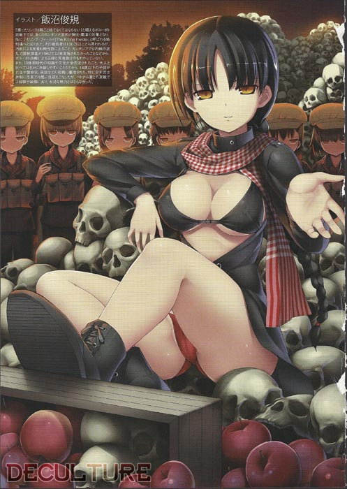
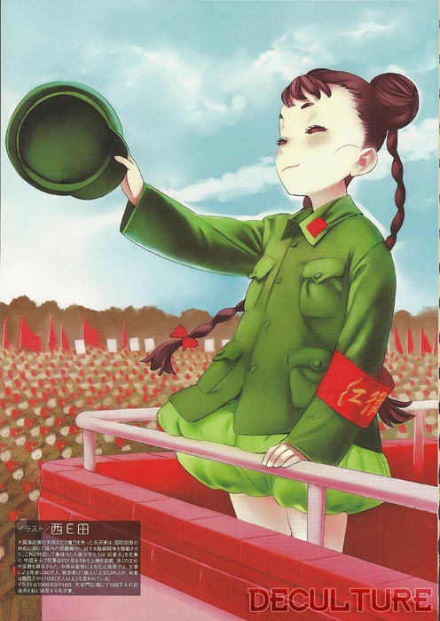
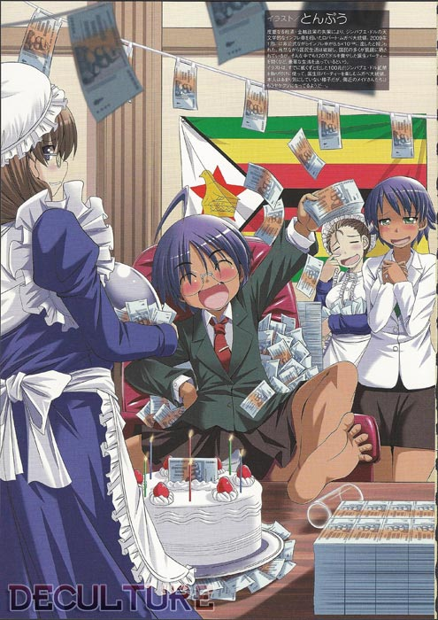
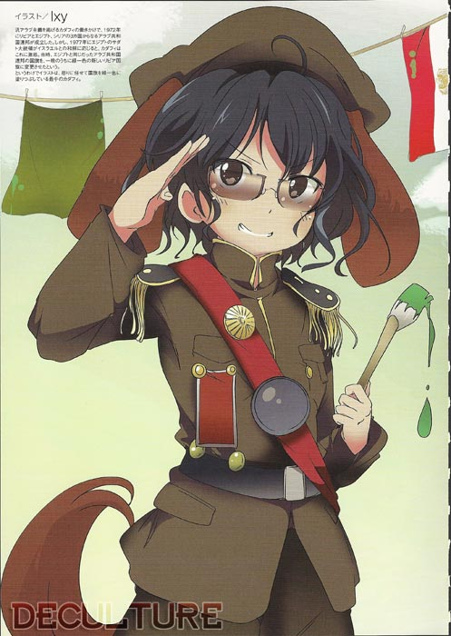
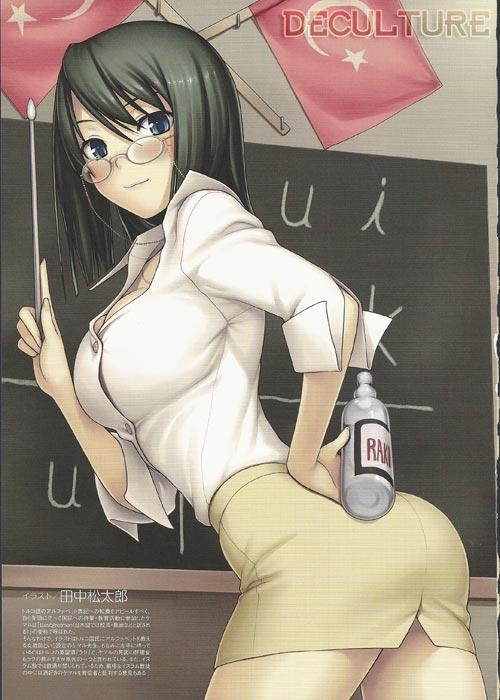
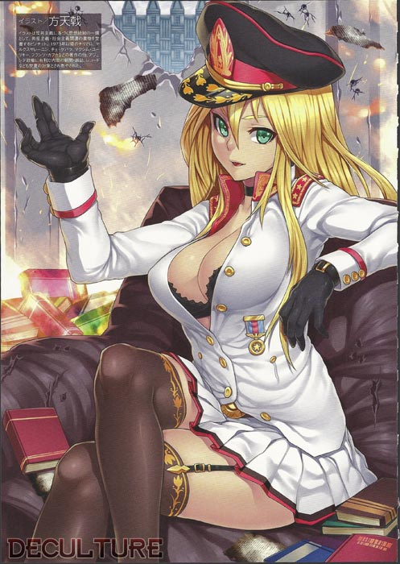

En esta ocasión, me gustaría hablar sobre una de las más recientes publicaciones que ha aparecido en Japón; *Nyotai ka!! Sekai no Dokusaisha Retsuden* (にょたいか！！世界の独裁者列伝 o, como lo traduce Kotaku: *En Versión Femenina!!? Biografías de los Dictadores del Mundo*). Siguiendo una tendencia en transformar todo en su versión moe (es decir, en una chica linda que te genera una mezcla de sentimientos entre ternura y excitación), este libro nos muestra las biografías de 70 dictadores de todo el mundo, de acuerdo a lo que reporta [Akiba Blog](http://blog.livedoor.jp/geek/archives/51372454.html) (quienes fueron los primeros en darle una hojeada), acompañados de una ilustración realizadas por diferentes artistas, entre los que destacan [Nishieda](http://www.nisieda.com/blog/) y [Takeshi Nogami](http://www.nisieda.com/blog/).

Si alguna vez los acosó la duda de cómo sería un mundo en el que Saddam Hussein fuera mujer o si Atatürk pudo haber sido una maestra sexy, no lo duden más, este libro posee la respuesta a todas esas preguntas, para que no les quiten el sueño. Habrá quienes vean este libro como una especie de ofensa, trivilizando los males que muchos de ellos causaron; aunque muy probablemente, esa no haya sido la intención de los autores, finalmente, los hechos que muestran en sus biografías son verídicos, y no son tan lindos como la ilustración que los acompaña.

Los chavos de [Deculture](http://imgur.com/a/2i3rH) se dieron a la tarea de escanear varias de estas imágenes, aquí les presento algunas:

[caption id="" align="aligncenter" width="493"] Adolf Hitler (Alemania)[/caption]

[caption id="" align="aligncenter" width="497"] Hideki Tojo (Japón)[/caption]

[caption id="" align="aligncenter" width="501"] Hugo Chávez (Venezuela)[/caption]

[caption id="" align="aligncenter" width="497"] Pol Pot (Camboya)[/caption]

[caption id="" align="aligncenter" width="496"] Mao Tse-tung (China)[/caption]

[caption id="" align="aligncenter" width="495"] Robert Mugabe (Zimbabue)[/caption]

[caption id="" align="aligncenter" width="495"] Saddam Hussein (Iraq)[/caption]

[caption id="" align="aligncenter" width="494"] Joseph Stalin (URSS)[/caption]

 

[caption id="" align="aligncenter" width="499"] Manuel Antonio Noriega (Panamá)[/caption]

[caption id="" align="aligncenter" width="495"] Omar Hasan Ahmad al-Bashir (Sudán)[/caption]

 

[caption id="" align="aligncenter" width="497"] Nicolae Ceausescu (Rumania)[/caption]

[caption id="" align="aligncenter" width="497"] Muamar Gadhafi (Libia)[/caption]

[caption id="" align="aligncenter" width="495"] Josip Broz Tito (Yugoslavia)[/caption]

 

[caption id="" align="aligncenter" width="499"] Benito Mussolini (Italia)[/caption]

 

[caption id="" align="aligncenter" width="497"] Francisco Franco (España)[/caption]

 

[caption id="" align="aligncenter" width="500"] Mustafa Kemal Atatürk (Turquía)[/caption]

 

[caption id="" align="aligncenter" width="497"] Augusto Pinochet (Chile)[/caption]
---

**Note about images**: This post originally contained images that are no longer available and will be replaced with similar images based on the context.

