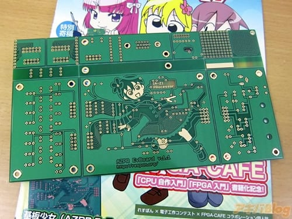

Para todos los fanáticos de la electrónica y que al mismo tiempo, son fans de las cosas Japonesas, o mejor conocidos como "Otakus," les tenemos grandes noticias... y es que finalmente podrán combinar sus dos aficiones. [*Akiba Blog*](http://blog.livedoor.jp/geek/archives/51375034.html) y [*Kotaku*](http://kotaku.com/5969674/your-circuit-board-cannot-be-this-cute) nos presentan una de las tarjetas de circuitos que más lindas del mercado, que te permitirán expresarte como un fan del anime o manga al mismo tiempo que trabajas en tu proyecto para tu clase de ingeniería...o en ese robot en el que estás trabajando... no me cree??? Pues échenle un vistazo a esto:

Ante el ojo inexperto, esto parecería sólo una revista o tal vez un cómic, en realidad es un fanzine llamado *Dojin Hard*, que de acuerdo a [*Akiba Blog*](http://blog.livedoor.jp/geek/archives/51375034.html), venía empaquetado con esto:

Una tarjeta de circuitos ordinaria, verdad???? Hmmm tiene el dibujo de la cara de una chica, y ya...  pero si la volteamos...

Zaz!!!  Un video nos muestra que no sólo tiene este original diseño, sino que además, está disponible en otros colores:

http://www.youtube.com/watch?v=J0TemwgNM8w

El nombre de la tarjeta es la AZPR EvBoard, también conocida como "Circuit Board Shojo."  Cabe aclarar que la tarjeta esta diseñada para aquéllas personas que tienen como pasatiempo el diseñar circuitos, pero bueno, uno nunca sabe...a lo mejor es el pequeño detalle con el que te puedes ligar a esa chica ingeniera dueña de tus quincenas.
---

**Note about images**: This post originally contained images that are no longer available and will be replaced with similar images based on the context.

