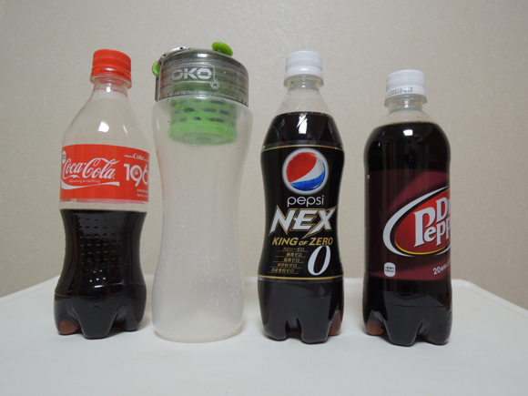
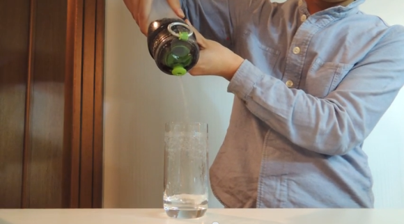

Bueno, a lo mejor muchos no saben de sobre que estamos hablando. Si no lo recuerdan, hace tiempo anda corriendo por internet un video y fotos sobre un filtro de agua, el **[Öko](http://www.okoh2o.com/whatisoko.php) **que se supone usa tecnología de la NASA para filtrar agua, y de acuerdo a su video promocional, es capaz de filtrar la Coca-Cola y dejarla transparente:

http://www.youtube.com/watch?feature=player_embedded&v=A3IOJIk0Jeg

Ante las dudas sobre si realmente funcionaba o no, los reporteros de [Rocket News](http://en.rocketnews24.com/2013/04/21/we-made-coca-cola-transparent-and-colorless-it-tastes-like/) se dieron a la tarea de ordenar uno de estos filtros mágicos, y probarlo no sólo con Coca-Cola, sino con otras dos bebidas azúcaradas que le dan diabetes a los niños gorditos, Pepsi y Dr. Pepper.

Aquí está el video del reportaje que hicieron:
http://www.youtube.com/watch?feature=player_embedded&v=_CjgmhaBEGk
Aquí hay otro video del Canal de Rocket News donde lo prueban con Mets Cola, y el resultado es aún peor:
http://www.youtube.com/watch?feature=player_embedded&v=R0zSBpn5GrI
En general, los resultados no fueron los esperados. Para empezar, al parecer si transparentó el agua del refresco, pero no completamente, aún dejó algunos residuos del color, dejando un vaso con un líquido que parece agua de calcetín (ya saben, como cuando dejan un calcetín sucio remojando). Además, el liquido aún contiene el azúcar, que en teoría es el principal mal de estas bebidas refrescantes. En otras palabras, lo que quedó al final fue un vaso de agua lodosa y azúcarada, con un leve sabor a Coca-Cola, pero sin gas... total decepción. Al parecer, el Öko es capaz de filtrar cualquier líquido obscuro en una versión más chafa del mismo, pero no en agua transparente para beber. O sea, si le echamos soya, saldra un líquido menos salado, si el hechamos jugo de naranja, probablemente saldrá un líquido con un leve sabor a la fruta.
No olviden dejarnos sus comentarios.
---

**Note about images**: This post originally contained images that are no longer available and will be replaced with similar images based on the context.

