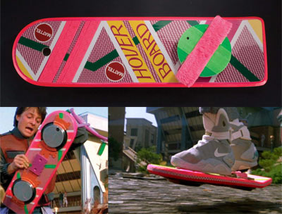

No podemos negar que ya nos encontramos en el futuro. Durante los 80's y 90's tanto la televisión como el cine, junto con algún otro cómic y libro, nos prometieron que a partir del año 20XX contaríamos con carros y patinetas voladoras, ropa que se seca sola, comida deshidratada en forma de píldoras, hacer viajes a la luna sería algo común y que además, todos contaríamos con nuestro robot asistente.

[caption id="" align="aligncenter" width="400"] Vamos Científicos, aún les quedan dos años[/caption]

 

[caption id="" align="aligncenter" width="355"] También nos prometieron que comeríamos personas en forma de galletitas!!![/caption]

Trece años después de haber cruzado el tan esperado año 2000, muchas de estas cosas aún no suceden, pero no teman, ya que el gobierno japonés ha decidido salir al rescate e iniciar un proyecto para la construcción de robots asistentes. De acuerdo al diario *[Yomiuri Online](http://www.yomiuri.co.jp/atmoney/news/20130427-OYT1T01323.htm), *el gobierno del país del Sol Naciente anunció su plan para desarrollar "robots enfermeros" que ayuden a las personas que enargadas de cuidar y asistir a los ciudadanos mayores. y así, preparar al país para el inevitable momento en el que casi el 40% de la población tenga más de 65 años.

De acuerdo al reportaje, se planea que los robots sean capaces de asistir a los enfermeros con tareas como levantar a los pacientes o ayudar los enfermos y residentes mayores que no puedan levantarse o tenga dificultades para caminar. Cabe recalcar que el gobierno Japonés planea que estos robots no sean costosos, esperando que no superen el precio de 100,000 yenes (alrededor de 1,013 dólares), con el objetivo de rentar los robots a cambio de unos cuántos cientos de yenes (casi lo que costaría comprar un refresco). Las autoridades esperan que en unos cuantos años los robots enfermeros se conviertan en algo común dentro de las casas de asistencia y hogares con residentes de la tercera edad, y de esta forma, planean responder a la falta de trabajadores de asistencia que ha afectado al país. Al mismo tiempo, busca estimular la economía con la creación de una industria orientada a su producción y mantenimiento. Con esto en mente, el gobierno espera invertir alrededor de 2.5 millones de dólares en el proyecto.

Al parecer aún estamos lejos de tener nuestros traductores como C3PO o aventureros intrépidos como R2D2, pero pronto seremos capaces de tener a un acompañante cibernético que nos recordará que debemos comer menos grasa porque tenemos el colesterol alto o que organice fiestas cuando no estamos.

[caption id="" align="aligncenter" width="500"] R2 si que sabe organizar una buena fiesta[/caption]

¿Qué opinan sobre esto? Creen que los japoneses serán capaces de llevarnos a una nueva era donde los hombres y los robots convivan o sólo estamos inciando la revolución de las máquinas que acabará con nosotros??? No olviden dejarnos sus comentarios.
---

**Note about images**: This post originally contained images that are no longer available and will be replaced with similar images based on the context.

