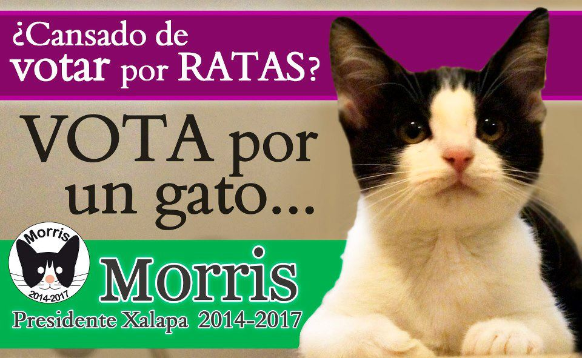
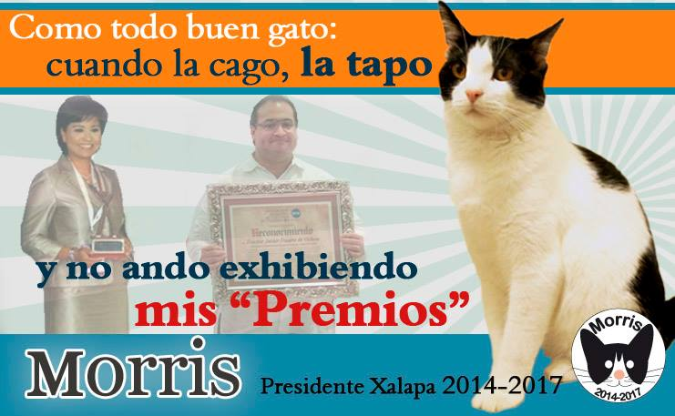

Pues aquí casi no hablamos de política, pero esta nota es tan buena que no podíamos dejarla pasar. En la contienda electoral por la alcaldía de Xalapa, se ha presentado un nuevo candidato que es mucho más popular que cualquiera de los otros contendientes. El "Candigato" Morris, un gato común y corriente, lanzó su campaña vía facebook, y hasta el momento tiene alrededor de 45, 000 seguidores, superando por mucho a las páginas de los demás candidatos.

Morris es un gato sencillo, no promete nada que no puede hacer. De hecho, no promete nada diferente a los demás candidatos: descansar y retosar. En un ejercicio de crítica ante el hartazgo del comportamiento de la clase política, Morris es la expresión de una ciudadanía que no confía en ninguno de los candidatos, Morris representa una opción mucho más carismática y al menos, más linda. Dentro de sus promesas de campaña está el deshacerse de las ratas y enterrar muy bien en su caja de arena sus desastres, y no dejarlos ahí al aire libre para que todos los vean y otros los tengan que limpiar, como hacen muchos políticos.

Precisamente, esta fue la idea detrás de la campaña de Morris, manejada por Sergio y Daniel, quienes asegurán que durante una plática con amigos, concluyeron que la clase política de este país no hace nada, lo mismo que hace el gato, pero al menos, esté es más bonito. Los dos asesores de campaña del gato comentaron que no esperaban que el "Candigato" se volviera el fenómeno viral que es ahora. Tal ha sido la popularidad del gato que el Instituto Electoral de Veracruz pidió a la ciudadanía abstenerse de votar por Morris, mientras que algunos políticos, como el diputado local Carlos Aceves, del PRI, e integrante del equipo de campaña del candidato del mismo partido por la alcaldía local, Américo Zuñiga, han afirmado que detrás de Morris hay una campaña negra.

Pero estos ataques de otros candidatos no importan. Morris es tan popular que inclusive ya ha aparecido en al menos dos medios internacionales, [Metro](http://metro.co.uk/2013/06/07/morris-the-cat-runs-for-mayor-of-mexican-state-capital-xalapa-3832272/) de Reino Unido y [L'Express](http://www.lexpress.fr/actualite/morris-le-chat-qui-a-gagne-l-admiration-de-la-plus-part-des-habitants-a-xalapa_1255445.html?doaction=read_on_site) de Francia. También ya cuenta con su propia página de campaña: [elcandigato.com](http://www.elcandigato.com/).

http://www.youtube.com/watch?v=fIsaoXLqEfY&feature=youtu.be

A opinión personal, considero que la clase política es exageradamente miope si cree que la gente es tan ignorante como para creer esas tonterías. Es obvio que Morris es una forma de protestar ante la incapacidad, ignorancia, corrupción y otras "virtudes" de nuestra clase política.  Morris ha alcanzado la popularidad a nivel nacional, muestra de que este desencanto y hartazgo es un síntoma generalizado en todo el país. En vez de criticar y andar haciendo declaraciones, sería más bien momento de autoanálisis y revisión, para entender cómo es posible que algo que empezó como una broma, terminara en el fenómeno viral que es, como una crítica abierta al sistema partidista mexicano.

Por mi parte, si estuviera en Xalapa yo si votaba por morris, como se dijo al principio, al menos él utiliza una caja de arena para que sea fácil limpiar su cochinero.

No olvides dejarnos tu opinión.
---

**Note about images**: This post originally contained images that are no longer available and will be replaced with similar images based on the context.

