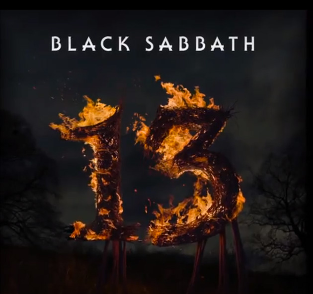

Haciendo un regreso después de más 30 años sin un disco de estudio con Ozzy Osbourne, varias peleas entre Ozzy y Tony Iommi, una breve reunión en el 2006 y por supuesto el lamentable deceso de una de las más grandes leyendas del Metal: Ronnie James Dio, Black Sabbath estrena el pasado jueves 13 de Junio nuevo disco de estudio: "13".

Con sencillos como [God is Dead](http://www.youtube.com/watch?v=1yIbxQpWr38) y [End of the Beginning](http://www.youtube.com/watch?v=o0W91FrTlYk) Sabbath lográ decirle a sus fans: regresamos y con mucho que ofrecer. Ademas, estarán teniendo en el 2013 una gira mundial esperamos tenerlos con nosotros pisando territorio mexicano el próximo[ 26 de Octubre en el Foro Sol](http://www.ticketmaster.com.mx/Black-Sabbath-boletos/artist/734569?brand=tm&tm_link=tm_homeA_rc_image2). Personalmente no puedo esperar a ver a Tony y Ozzy juntos en un escenario por primera vez en mi vida.

http://www.youtube.com/watch?v=1yIbxQpWr38

http://www.youtube.com/watch?v=o0W91FrTlYk
---

**Note about images**: This post originally contained images that are no longer available and will be replaced with similar images based on the context.

