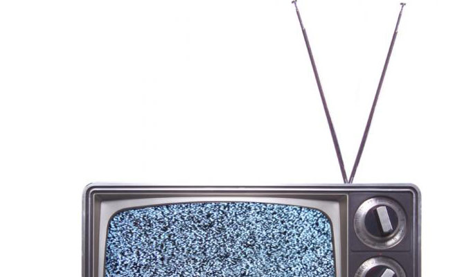

Después de hacer la primera prueba el 31 de mayo pasado las señales de televisión analógicas de Tijuana pasarán a la historia este jueves.

Estados Unidos apago la señal analógica de televisión en el **2009**, unos años después nos empezamos a sumar como país a la televisión digital, siendo **Tijuana la primera ciudad sin señales analógicas de forma definitiva en México**.

Quizás te estés preguntando, ¿cuál es la diferencia?

El contraste más claro es que las señales se codifican de forma diferente, siendo la televisión digital la que codifica de forma binaria, **habilitando así la posibilidad de crear vías de retorno entre el consumidor y el productor** de contenidos.

Aquí te dejamos una lista completa de los beneficios de la Televisión Digital (DTV):

 
	- Calidad de video HD (Si tienes recepción la imagen se verá perfecta, si no tienes suficiente simplemente no se verá, no hay medias tintas como en la tv analógica)
	- Mayor cantidad de canales de televisión, estábamos haciendo mal uso de nuestras bandas con la televisión analógica, no podíamos tener un canal 6 porque ese causaría interferencia entre el 5 y el 7, cosa que con la digital no pasa, incluso en un mismo canal podríamos tener diferentes transmisiones
	- El audio se transmite en estéreo, casi con la calidad de una emisora FM
	- Accesibilidad a dispositivos móviles, siendo la señal digital, no sólo podrás sintonizar la TV con una televisión si no que puedes ahora usar celulares y "tablets" (claro es importante ver que tu celular funcione con el formato ATSC)
	- Creación de aplicaciones, como la televisión es interactiva podría incluso personalizar la transmisión que el canal te está mandando.

Es importante recordarte que **no todas las televisiones están listas para recibir este tipo de transmisiones**, las televisiones nuevas ya cuenta con el decodificador digital, pero en caso de que tengas una televisión vieja necesitas comprar una [caja convertidora](http://www.amazon.com/s/ref=nb_sb_ss_i_1_11?url=search-alias%3Daps&field-keywords=digital%20tv%20converter%20box&sprefix=digital+tv+%2Caps%2C194).
---

**Note about images**: This post originally contained images that are no longer available and will be replaced with similar images based on the context.

