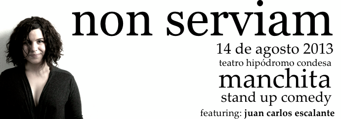

Si eres fan de este tipo de comedia, estarás encantado de saber que [Manchita](https://twitter.com/manchita) finalmente presentará un show completo de una hora en el** teatro hipódromo condesa** el **14 de agosto de 2013**. 

El costo de la entrada será de **200 pesos** y además de disfrutar a [Manchita](https://twitter.com/manchita) podrás reír con Juan Carlos Escalante que la estará acompañando en este show. "invité a Juan Carlos Escalante porque, además de ser la mejor pluma de comedia que conozco, fue el primer valiente que se aventó a subirme a un escenario." nos explica la comediante.

Hay que ponerse las pilas porque sólo hay **77 lugares**. En caso de que estés listo para hacer tu reservación, manda un email a andreaortegalee@gmail.com .

¡Allá nos vemos!
---

**Note about images**: This post originally contained images that are no longer available and will be replaced with similar images based on the context.

