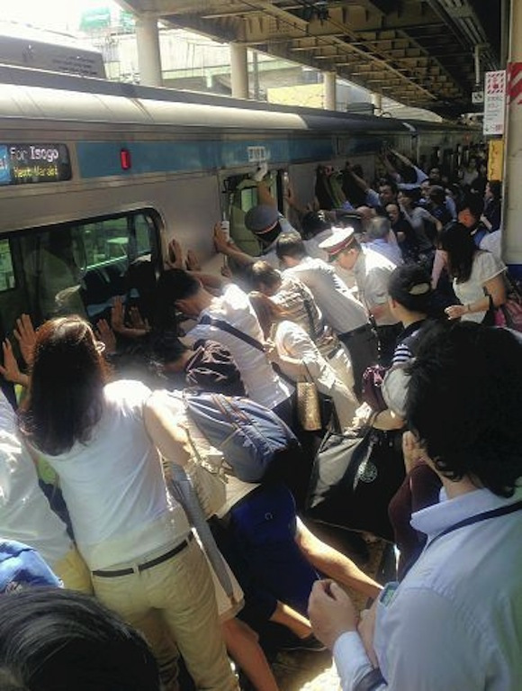

Esta es una historia que me da mucho gusto compartir, y que habla de cómo cuando la gente se une, todo es posible. El día de ayer, Lunes, alrededor de las 9:15 am, en la estación de Minamiurawa, en la prefectura de Saitama, una mujer resbaló y quedó atrabada entre el tren y la plataforma del anden, sostenida por sus caderas. Por suerte, los trabajadores de la línea del metro estaban prestando atención cuando ocurrió el accidente y detuvieron el tren antes de que avanzara anunciando que alguien estaba atrapado.

De acuerdo a los testigos, los empleados primero solicitaron a las personas que habían abordado el tren que se colocaron en el lado opuesto del tren, para ver si con el cambio en el peso era posible rescatarla. Sin embargo, al ver que esto no daba resultado, lo más maravilloso e inesperado sucedió, los empleados pidieron ayuda a todas las personas que habían abordado el tren, y a aquéllas que se encontraban sobre la plataforma.

Acto seguido, todo el mundo bajo del tren e inmediatamente se pusieron a empujar para poder levantar el tren y así poder rescatar a la chica en cuestión. Una muestra de cómo el trabajo en equipo puede vencer cualquier obstáculo, y más importante, que la gente aún está dispuesta a ayudar a una persona en problemas...

Si se preguntan como es que esto fue posible, la East Japan Railways Company explicó que el espacio entre el tren y la plataforma es de 20 cm, al parecer lo suficiente como para que alguien pueda caer y atascarse. La empresa también explicó que el tren pesa alrededor de 32 toneladas, incluyendo la base y las ruedas, pero fue gracias a la suspensión del mismo que fue posible moverlo sin alterar su posición sobre las vías.

Una gran noticia para empezar esta semana en Japón!

¿Qué opinas sobre esta nota? Déjanos tus comentarios.
---

**Note about images**: This post originally contained images that are no longer available and will be replaced with similar images based on the context.

