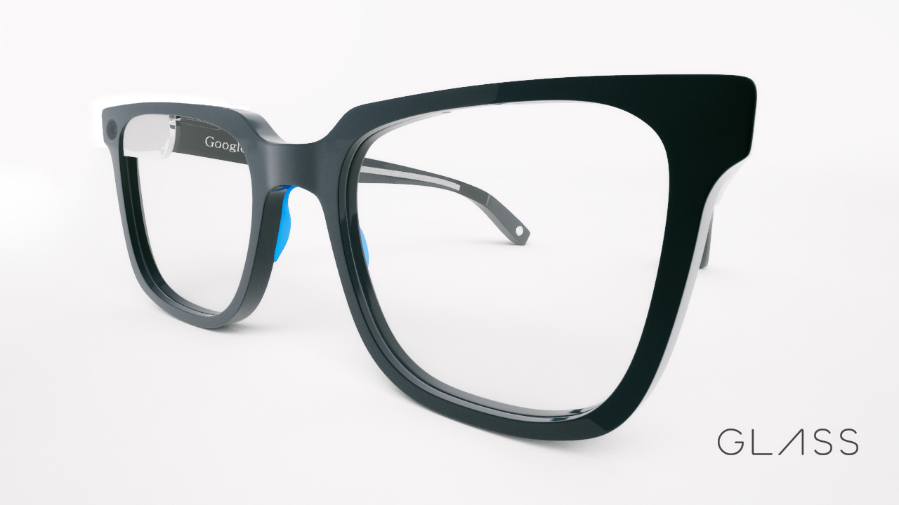
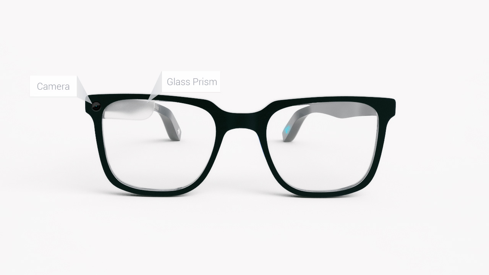
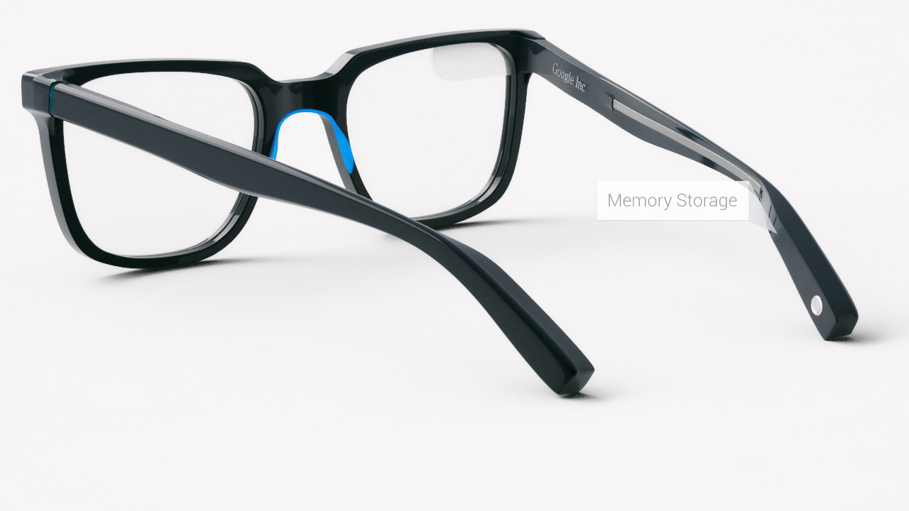
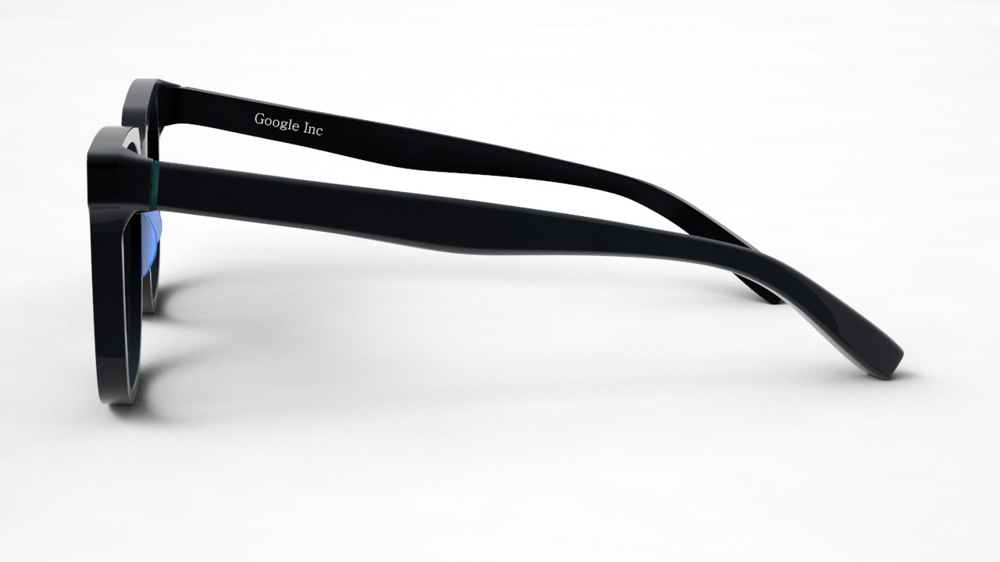

Pues a los chicos de [Sourcebits](http://www.sourcebits.com/) sí. Y no sólo lo dicen por decir, trabajaron para hacer realidad lo que tenían en su imaginación."** Google Glass es una maravilla**, pero quizás **no tiene el diseño mas atractivo**". Después de re-imaginar el producto así es como les quedó: 

Ya me imagino como se vendería este diseño para toda la hipsterisa. ¿Te gustaron? No dejes de comentarnos.
---

**Note about images**: This post originally contained images that are no longer available and will be replaced with similar images based on the context.

