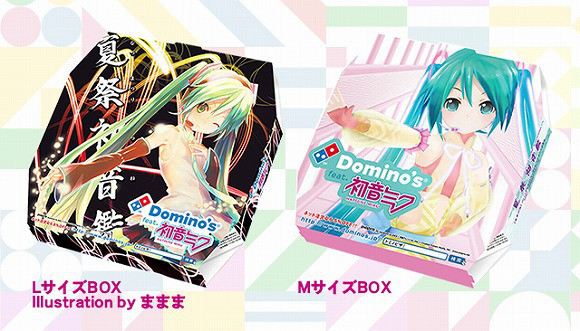
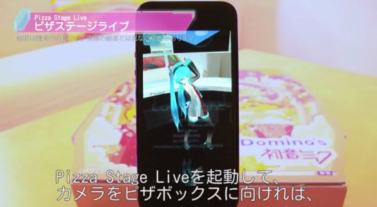

[Hatsune Miku](http://en.wikipedia.org/wiki/Hatsune_Miku), la primer ídolo virtual del mundo es toda una sensación, no sólo aquí en Japón, pero en todo el mundo. Desde comerciales para [Toyota](https://www.youtube.com/watch?v=E15PE7iGT0U) (incluyendo un [Flashmob](https://www.youtube.com/watch?v=cqLBfm58R_Y) en Nueva York), [video juegos](https://www.youtube.com/watch?v=qkmdR1es3Es) y conciertos en [vivo](https://www.youtube.com/watch?v=-weR1PHrpZs), Miku junto con el resto de l@s [vocaloids](http://es.wikipedia.org/wiki/Vocaloid) se han convertido en tod un fenómeno cultural. Por eso mismo, no es sorpresa que Domino's Pizza Japón haya decidido saltar al barco de la fama de Hatsune Miku a lanzar su nueva aplicación para iphone.

Esta aplicación no sólo te permite ordenar una pizza sin la tediosa y molesta tarea de hablar por teléfono con alguien, sino que, sus usuarios recibirán su pizza en una de las dos cajas especiales en las que figura Miku, y si tienen la suficiente suerte, puede ser entregada en una de las motos que ha sido decoradas para la ocasión:

Pero esto no es todo. La aplicación utiliza un software de realidad aumentada, el cual permite poner imágenes generadas por computadora sobre objetos reales, para poder dar a los usuarios la experiencia de un show privado en vivo protagonizado por Miku:

La aplicación tiene otras características, como una social camera que te permite tomarte fotos junto con Miku, pero creo que yo no puedo explicarlo todo mejor que como lo hizo Scott Oelker, presidente de la rama japonesa de la compañía en el siguiente video:

http://www.youtube.com/watch?v=gW2D_Votd2Y

¿Pedrías más pizzas de Domino's sólo por ver a Miku en vivo en la mesa de tu cocina? Déjanos saber tu opinión en los comentarios!
---

**Note about images**: This post originally contained images that are no longer available and will be replaced with similar images based on the context.

