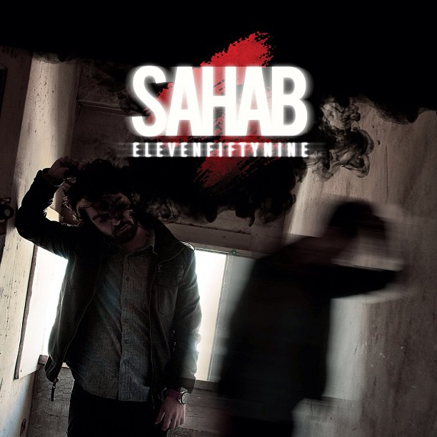

Muy a pesar de que **Fresno** es singularmente conocida por ser la ciudad con más borrachos en Estados Unidos ([America's Top 25 Drunkest Cities](http://www.youtube.com/watch?v=NJ5G5shkDxU)), es la ciudad donde vive Sahab.

Personalmente creo que es un gran artista y que trae una propuesta única. Es de esas bandas que seguro cargas en tu celular y que por venir de una escena muy pequeñita de una ciudad igualmente pequeñita pues no te queda de otra más que comprar oficialmente su música. Y además lo haces con gusto, porque sabes que estas pagando algo que escucharas muchas veces.

La promoción que hizo para su último lanzamiento me parece increíble. Aunque me preocupa un poco porque me deja ese sabor de que Sahab en el fondo es un asesino serial, pero no importa, es **un asesino serial que compone buena música**. Espero que sólo en los videos mate a sus novias y que en la vida real sea algo así como Dexter. 

Sahab por ahora tiene 2 discos, el **Scarecrow** (2011) y el **11:59** (2013), por más o menos 16 dlls compras los dos.

Aquí te dejo con el trailer de la serie de videos promocionales del último disco y además como bonus especial mi canción favorita del primer disco: **No?** . 

http://www.youtube.com/watch?v=E3dlmWlf9kk

http://www.youtube.com/watch?v=-0LD8gTztC0

Más Bonus:

[http://t.co/QNdnmTZtNt](http://t.co/QNdnmTZtNt) for 40% off everything! Enter code: turkeyleg at checkout! Happy holidays [#blackfriday](https://twitter.com/search?q=%23blackfriday&src=hash) [http://t.co/k0tjbOci0c](http://t.co/k0tjbOci0c)

— Sahab (@iAmSahab) [November 29, 2013](https://twitter.com/iAmSahab/statuses/406351780390662144)

Página Web: [http://iamsahab.com/](http://iamsahab.com/) <- Aquí encontraras la serie de videos promocionales del último disco
Tienda en Línea: [http://iamsahab.bigcartel.com/](http://iamsahab.bigcartel.com/)
Youtube: [http://www.youtube.com/user/iAmSahab/videos ](http://www.youtube.com/user/iAmSahab/videos)
---

**Note about images**: This post originally contained images that are no longer available and will be replaced with similar images based on the context.

