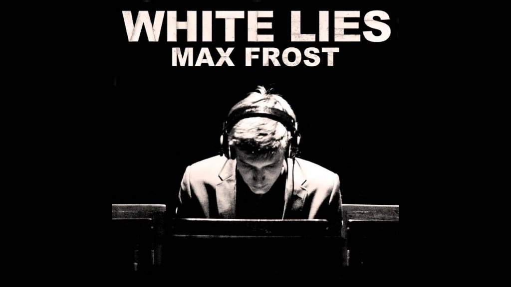

**Max Frost** es un músico de Austin, Texas que toca un genero combinado de hip-hop, soul y funk. Max empezó a tocar desde los 8 años de edad y empezó a salir en shows a los 12 años con varios artistas como *Bob Schneider y Kydd*. Su música esta influenciada por *Erykah Badu y D’Angelo* y comenzó a agregar hip-hop en su música tratando de combinar un poco de blues. Espero les guste, dejen sus comentarios o recomendaciones en la parte de abajo.

https://www.youtube.com/watch?v=RFDdc_UKBHo
https://www.youtube.com/watch?v=nix1nEZhpZ4

[website](http://maxfrost.net/)
[youtube](https://www.youtube.com/user/maxfrostguitar)
[twitter](https://twitter.com/maxfrost)
[facebook](https://www.facebook.com/maxfrostmusic)

808
---

**Note about images**: This post originally contained images that are no longer available and will be replaced with similar images based on the context.

