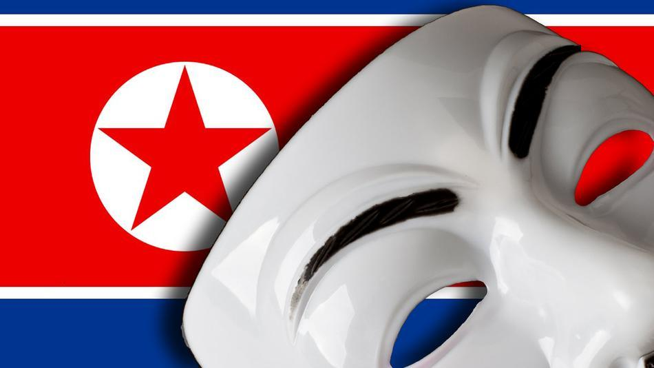

Uno se da cuenta de que las cosas están serias cuando nuestros amigos de Anonymous aparecen en la historia. El grupo conocido como “Anonymous Korea” afirma haber tirado muchas páginas web del gobierno de Corea del Norte el pasado sábado, horas después de que se declaró un estado de guerra con Corea del Sur.

Lo ingenieros en Corea del Norte aún no se pueden recuperar de todo del ataque, hay páginas que aún son inaccesibles en estos momentos.

Aquí te dejamos el tuit de “Anonymous Korea” donde indica los websites para que tú mismo veas que es lo que pasa.
[#OpnorthKorea](https://twitter.com/search/%23OpnorthKorea) [#Tangodown](https://twitter.com/search/%23Tangodown)[airkoryo.com.kp](http://t.co/tHFAk5c3nx) [naenara.com.kp](http://t.co/6E9yDxXCVF)[korea-dpr.com](http://t.co/OAc4d517vA)[friend.com.kp](http://t.co/vqll8epN6z)[uriminzokkiri.com](http://t.co/Dflx14aMrC)

— Anonymous_Korea (@Anonsj) [March 30, 2013](https://twitter.com/Anonsj/status/317866862660694016)

Vemos que el hashtag de esta serie de ataque es [#OpNorthKorea](https://twitter.com/search?q=%23opnorthkorea&src=tyah), por lo pronto yo veré que puedo hacer para apoyar este movimiento.

*La imagen de este post fue extraída de: [Mashable](http://mashable.com)*
---

**Note about images**: This post originally contained images that are no longer available and will be replaced with similar images based on the context.

