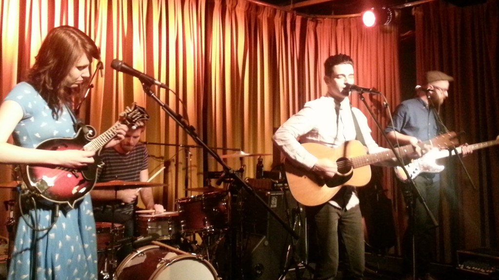

**Twin Forks** es una banda de Folk Rock de Boca Raton, Florida que empezo en el 2011 por Chris Carrabba. La banda actualmente esta formada por:

Chris Carrabba – *Voz, Guitarra*
Suzie Zeldin – *Voz, Mandolin*
Ben Hamola – *Batería*
Jonathan Clark – *Bajo*

Yo describiría Twin Forks como una banda que le gusta juntar voces femeninas y masculinas con música country, folk y "americana". Sus influencias son country antiguo y folk clásico.

Espero les guste y escuchen más canciones de ellos (se las recomiendo mucho), deja tus comentarios o recomendaciones de las otras canciones que te gustaron abajo. También me ayudarían mucha si me dicen cuantas canciones por post son las que esperarían.

https://www.youtube.com/watch?v=DkOE17af9eo

808
---

**Note about images**: This post originally contained images that are no longer available and will be replaced with similar images based on the context.

