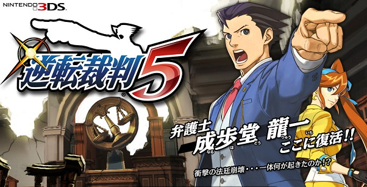
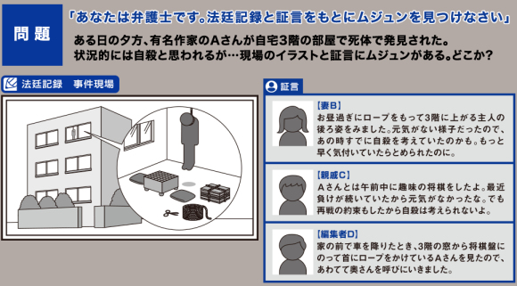

Este jueves se estrenará en Japón el juego para el Nintendo 3DS *Gyakuten Saiban 5*, mejor conocido en occidente como *Phoenix Wright: Dual Destinies. *Con este motivo, la companía desarrolladora del juego, CAPCOM, decidió despertar de nuevo el instinto de detective de los fans del juego al pedirle a las personas que visiten la [página oficial de *Phoenix Wright *](http://www.capcom.co.jp/gyakutensaiban/5/cam_pillow.html#caution)que resuelvan un crimen. Aquéllos que puedan resolver el acertijo entrarán en el sorteo de 50 "almohadas de sangre" de edición limitada para que cuando los jugadores vayan a dormir, puedan aparentar ser una de las víctimas del juego.

La situación del crimen es la siguiente:

Una tarde, el famoso escritor "A-san" fue hallado muerto, colgado en un cuarto del tercer piso de su casa. Al parecer fue un suicidio; sin embargo, algo no está bien...

	- **B-San (esposa):** Justo antes de almorzar, vi a A-san subir al tercer piso de la casa cargando una cuerda. Parecía algo deprimido, así que supongo que estaba pensando en matarse. Si tan sólo me hubiera dado cuenta antes hubiera podido detenerlo.
	- **C-San (pariente):** Había estado jugando [shogi](http://es.wikipedia.org/wiki/Shogi) con A-san durante la mañana. Recientemente, ha perdido muchas veces  así que no estaba muy contento. No obstante, estaba determinado a vencerme, así que no puedo creer que haya decidido matarse.
	- **D-San (editor):** Cuando me bajé de mi carro justo enfrente de la casa, pude ver a A-San parado sobre su mesa de shogi poniéndose una cuerda alrededor de su cuello, así que fui a avisarle a su esposa tan rápido como pude.

Qué tal Adeektos??? Ya dieron con alguna pista?? Si es así, vayan a la página y traten de resolver el misterio. En caso de que aún no hayen algo sospechoso, no se preocupen. CAPCOM también regalará 5 almohadas a aquéllos que twitteen sobre el concurso por medio de la página con el hashtag *#Gyakuten5*.

La versión japonesa del juego saldrá al mercado el 25 de julio y costará 5,990 yenes. Para occidente tendremos que esperar hasta otoño de este año. Aquí les dejamos el trailer del juego:
http://www.youtube.com/watch?v=bWbqfgbRVWs
---

**Note about images**: This post originally contained images that are no longer available and will be replaced with similar images based on the context.

