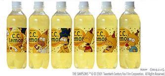

Saludos a todos los Adeektos desde la Tierra del Sol Naciente!!!

En esta ocasión, para continuar con nuestra larga lista sobre celebridades occidentales que han aparecido en comerciales en Japón, por varios miles de millones de yenes, obviamente, hemos decidido recurrir a la familia más famosa de la animación durante los 90's: Los Simpson.

Sabemos que la calidad de la serie ha decáido desde su época dorada, pero fue precisamente durante la cima de su carrera que la familia favorita de Springfield apareció en una serie de comerciales sobre una bebida de limón llamada C.C. Lemon, que promete no sólo un refrescante sabor, sino ser una fuente de vitamina C. A pesar de que yo soy fan de la bebida, es lamentable saber que estos comerciales fueron la razón por la que Los Simpson se dieron a conocer en Japón. La serie sólo fue transmitida por cable, un lujo por estos lares, por lo que muy poca gente la vio. Más importante aún, mucho del humor de la serie se pierda al ser traducida al Japonés, y sinceramente, muy poca gente les vio lo gracioso. Esto yo lo comprobé con una amiga Japonesa que habla español, cuando vio los Simpson en español se murió de la risa, pero en Japonés, como ella misma me explico, se le hacían tontos y sin sentido.

En fin, este post ya se volvió más largo de lo que estaba planeado, así que sin más preámbulos, les dejo los comerciales de Los Simpson y C.C. Lemon:

http://www.youtube.com/watch?v=FZ0HQ0ldN8M

http://www.youtube.com/watch?v=UEmW4w0J39U

http://www.youtube.com/watch?v=RfsJx8J4EBA

http://www.youtube.com/watch?v=VHUtK1it0Fs

De pilón, les dejo el trailer en Japonés de la película:

http://www.youtube.com/watch?v=GMKVeTvBnso
---

**Note about images**: This post originally contained images that are no longer available and will be replaced with similar images based on the context.

