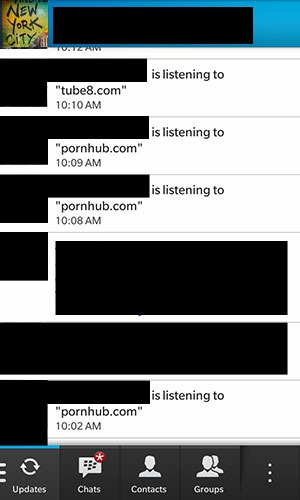

Al parecer todo ese tiempo que se tomaron los de RIM para terminar su nuevo OS fue por que agregaron funciones totalmente innecesarias para un celular. Existe una función donde puedes **compartir con amigos y familiares que es lo que estás viendo en la web**, adiós privacidad. Sonará como muy buena idea para los padres de familia paranoicos o las novias overly attached girlfriends, pero muy mala idea para los amantes del pr0n.

De acuerdo con una captura de pantalla tomada por los amigos del [foro Crackberry](http://crackberry.com/), tus contactos pueden ver actualizaciones del tipo "**escuchando a pornhub.com**"

En teoría esta** característica viene apagada** por default, pero si eres de esos que se pierden 41 minutos, yo que tu volvía a revisar.

*La imagen de este post fue extraída de: [Enter.co](http://www.enter.co/)*
---

**Note about images**: This post originally contained images that are no longer available and will be replaced with similar images based on the context.

