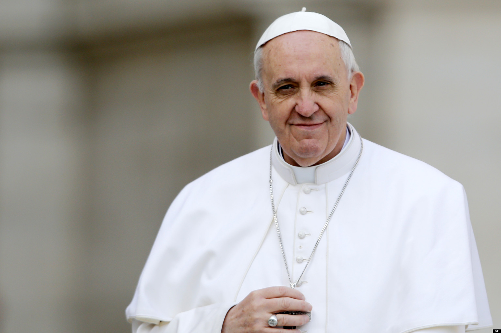

Como parte del gran esfuerzo para utilizar las redes sociales para conectar los católicos de todo el mundo, el Papa empezara a perdonar tus pecados vía Twitter.

De acuerdo con la publicación de la Sagrada Penitenciaría Apostólica del Vaticano, el Papa Francisco podrá estar dando indulgencias plenarias a sus seguidores de Twitter. El papa típicamente ofrece indulgencias a aquellos que ve en persona, pero por primera ocasión en este año también las dará de forma virtual.

A mí se me hace algo increíble, pero no dudo que se preste a burlas. Ya me imagino un hashtag como el de Mancera en Twitter, *"hazme un paro Francisco y perdóname mis pecados"*.

Cuenta oficial del Papa en español: [https://twitter.com/Pontifex_es](https://twitter.com/Pontifex_es)
---

**Note about images**: This post originally contained images that are no longer available and will be replaced with similar images based on the context.

