Es un hecho muy conocido en el resto del mundo que las habitaciones japonesas, en general, no son muy grandes. Esta situación varía mucho de donde vivas, ya que en algunas zonas rurales se puede tener un poco más espacio que en las zonas urbanas para poder construir. Gran parte del problema es la situación de la tierra en Japón, ya que alrededor del 70% del territorio japonés no es apto para la construcción, debido a la gran cantidad de bosques y áreas montañosas en el país. Esto ha provocado que los japoneses que aspiran al sueño de poseer una casa propia, deban pagar cantidades exorbitantes de dinero. Sin embargo, otras personas han optado por aprovechar mejor sus recursos, utilizando el concepto de *kyoushou juutaku*, a través del cual, ya sea por el bien del medio ambiente o por necesidad económica, las casas son diseñadas para hacer uso de los más pequeños y angostos espacios, haciendo uso del terreno que de otra forma, sería absorbido por otras propiedades más grandes o que antes era considerado inútil para la construcción. Así que, aquí en Adeektos hemos decidido mostrarles las casas que más nos han impactado con su diseño:

**1.- Casa Nada, Hyogo Prefecture: **Cuando no expandirte hacia los lados, hazlo hacia arriba.

[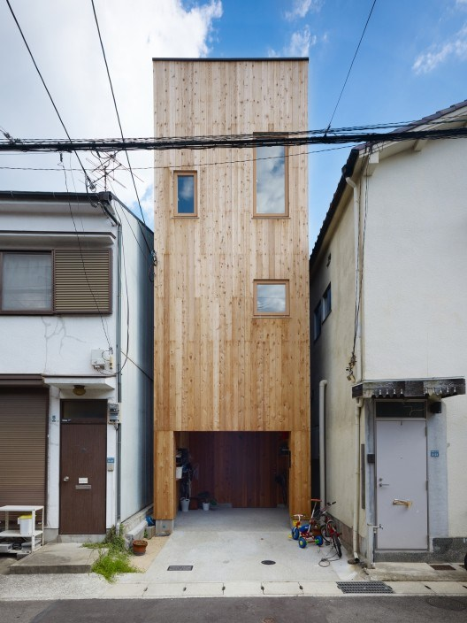](../img/nada-1.jpg)

[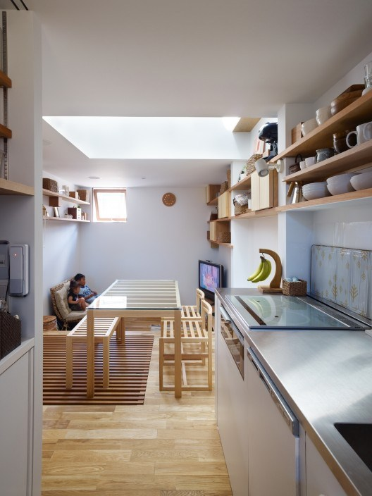](../img/nada-2.jpg)

[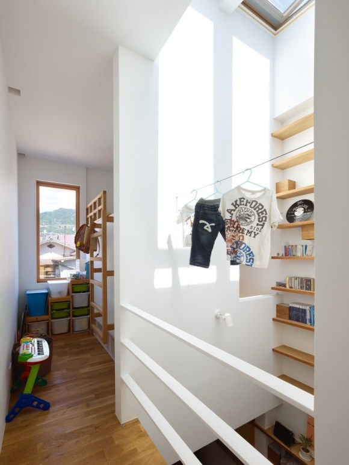](../img/nada-3.jpg)

[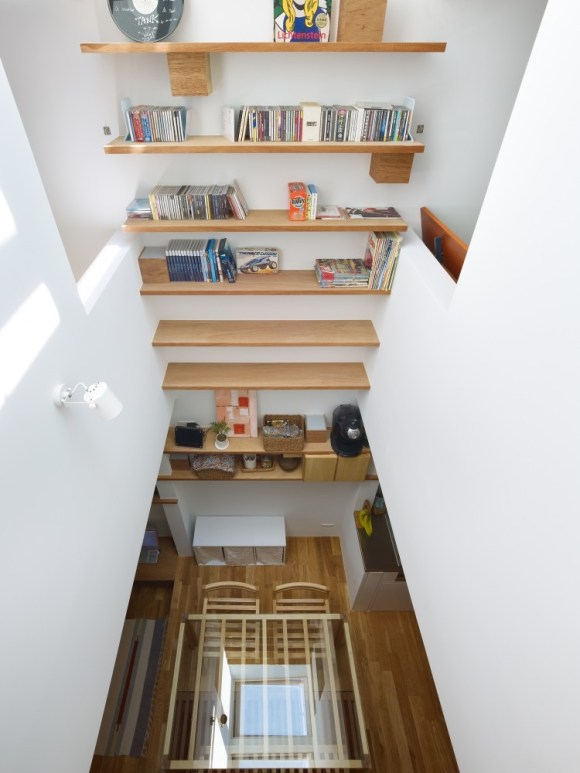](../img/nada-extra-2.jpg)

[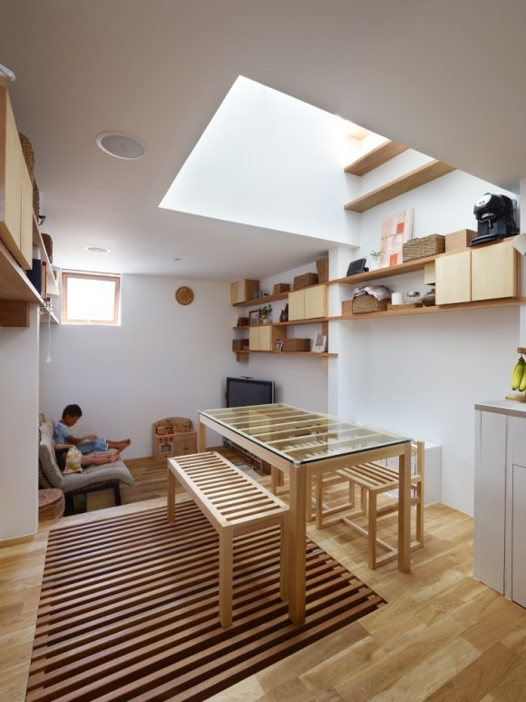](../img/nada-extra-3.jpg)

**2.-Casa Hori no Uchi, Suginami, Tokyo.   **Si lo único que puedes pagar es un pequeño terreno al final de la calle, no importa!!! Un buen diseño puede solucionarlo todo y darte una cómoda vida.

[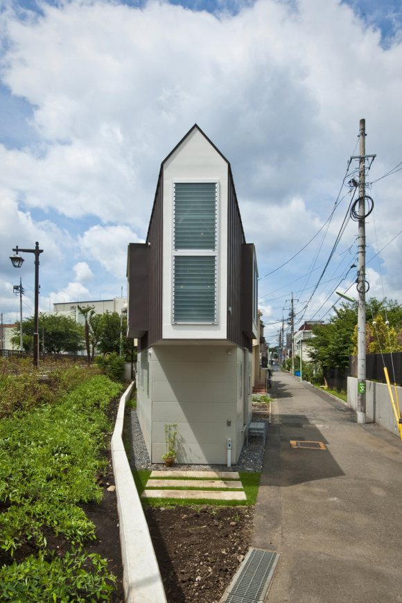](../img/hori-nouchi-1.jpg)

**3.- La Casa Jardín: **A simple vista, parece un edificio de departamentos, pero en realidad es una casa de 4 pisos. Diseñada por Ryue Nishizawa para unos clientes que querían vivir en el centro de la ciudad, pero no podían pagar un terreno grande, la casa aprovecha la luz natural por medio de grandes ventanas y utiliza jardines para dar privacidad a sus habitantes.

[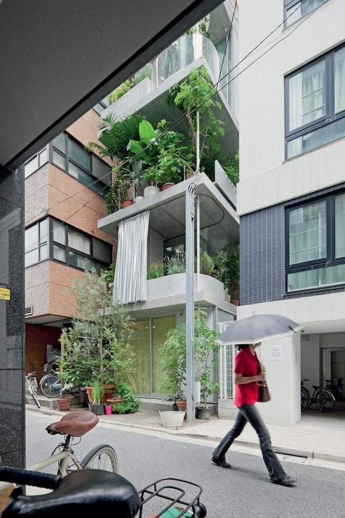](../img/garden-house-extra-2.jpg)

[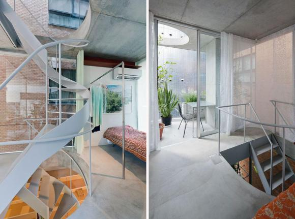](../img/garden-house-extra-3.jpg)

[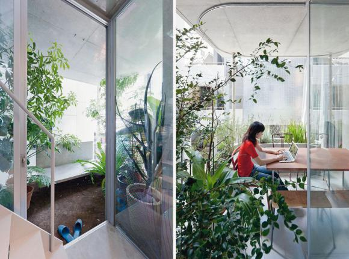](../img/garden-house-extra-1.jpg)

 

**4.- La Casa "63.02," Nakano, Tokyo.**

****Llamada así por el ángulo de inclinación en el que se encuentra, la casa es uno de los mejores diseños minimalistas que podrás encontrar en todo Japón. Los arquitectos Jo Nagasaka y Toshiharu Ono la diseñaron para que se aprovechar lo mejor que se pudiera el pequeño espacio con el que cuenta y al mismo tiempo, sus habitantes pudieran apreciar una excelente vista de la calle.

[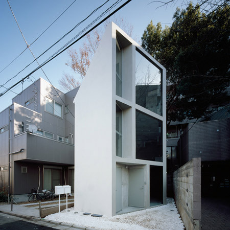](../img/63-02-house-1.jpg)

[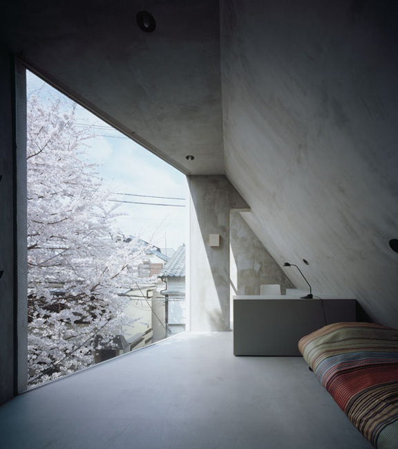](../img/63-02-house-3.jpg)

**5.-Moriyama House**

Lo que por fuera parece un simple contenedor, por dentro es una joya del diseño. Esta casa cuenta con un jardín interno, baño, cocina, comedor y recámaras. Una serie de tragaluces y ventanas permite que la casa obtenga luz natural durante el día, reduciendo el gasto en energía eléctrica

[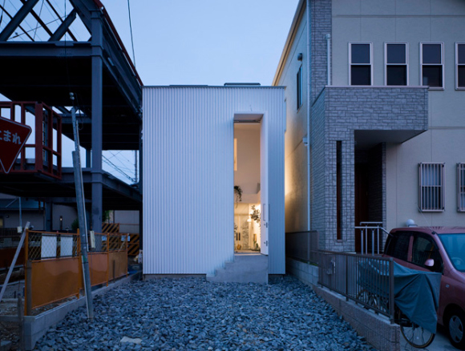](../img/moriyama-1.jpg)

 

[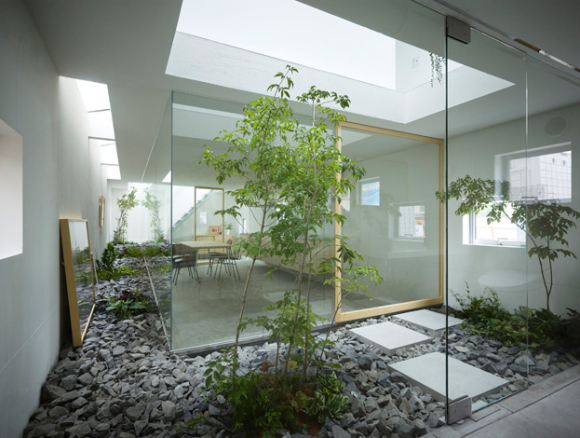](../img/mori-yama-2.jpg)

 

[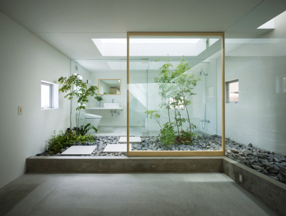](../img/mori-yama-3.jpg)

 

 

[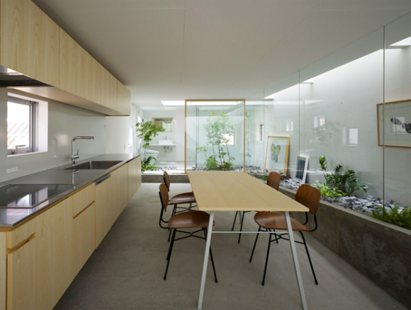](../img/moriyama-extra-2.jpg)
---

**Note about images**: This post originally contained images that are no longer available and will be replaced with similar images based on the context.

