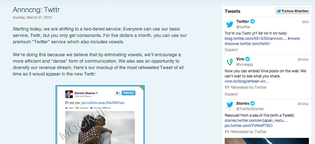

El día de las bromas de abril (en inglés April fools' day), también conocido como pez o pescado de abril (traducción literal del francés poisson d'avril o del italiano pesce d'aprile), es una fiesta dedicada a las bromas similar al día de los Santos Inocentes. Se celebra en Francia, Finlandia, Australia, Galicia, Alemania, Italia, Bélgica, Reino Unido (y por tradición británica Menorca, Portugal, Estados Unidos, Brasil y otros países) cada primero de abril.

Año tras año las empresas de tecnología se esmeran por hacer productos de broma para este día, de los que siempre destacan, son los amigos de **Google.**

Aquí te dejamos una lista de los 10 mejores de este año:

	- Google agrega una función a Gmail llamada “Blue” donde todos los íconos y textos son azules (“We tried orange, bown, brown was a disaster”).

	- Google Maps ahora tiene una opción para desplegar mapas de tesoros escondidos.

	- Google agrega la posibilidad de “oler” los resultados de búsquedas. El producto se llama “Google Nose” (Creo que mucha gente si quisiera que fuera realidad).

	- Sony crea audífonos para mascotas.

	- [Twitter](http://blog.twitter.com/2013/03/annncng-twttr.html) elimina las vocales en sus cuentas gratuitas y cobrará $5 dólares para poder usarlas en los tweets.
 

	- El sitio Kayak agrega una opción para buscar parejas mientras viajas.

	- El sitio de videos Vimeo, cambia su nombre a Vimeow y ahora solo acepta videos de gatos.

	- El sitio The Pirate Bay cambia su nombre a The Freedom Bay. 

	- El [innovador microondas](http://conversations.nokia.com/2013/04/01/nokia-turns-up-the-heat-with-its-first-microwave/) que presenta Nokia.

	- La consola de videojuegos de Toshiba que mide la ira.

¿Qué opinas de estas bromas? Increíbles ¿no?
---

**Note about images**: This post originally contained images that are no longer available and will be replaced with similar images based on the context.

