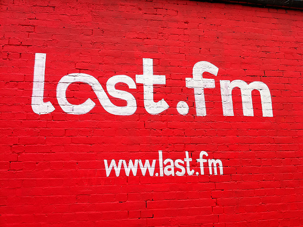

**Last.fm** es uno de los servicios musicales más viejos que existen actualmente. Personalmente llevo años *scrobbleando* lo que escucho y me encanta poder ver en números claramente cual banda escucho más y que canciones son mis preferidas. Lleva años ya ofreciendo música en streaming pero sin ser on demand (salvo las que regalan los propios artistas) y siempre mediante emisoras de radio personalizadas.

Aquí es donde aparece Spotify, pues **ahora podrás escuchar todo el catálogo de Spotify desde Last.fm**. De ese modo podremos escuchar toda la música que aparezca en una página de un artista, de un álbum o de un usuario, siempre que esté presente en el catálogo de Spotify.

No hay que olvidar que es una versión beta y que todavía tiene algunos problemas. 

¿Ya lo usaste? ¿Te gustó? No dejes de comentarnos.
---

**Note about images**: This post originally contained images that are no longer available and will be replaced with similar images based on the context.

