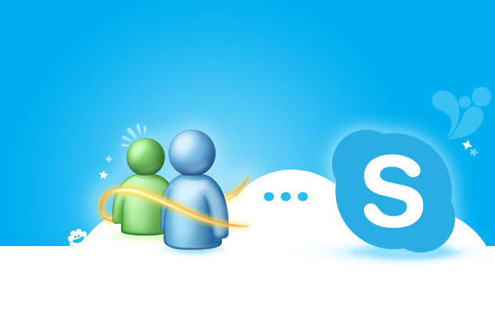

Uno se puede poner medio nostálgico con esta noticia. Me recuerdo perfectamente instalando la versión 1.0 de Messenger en mi flamante PC con Windows 98, 64 mb de ram y un procesador Celeron de 400mhz. **Mudarse de ICQ a Messenger como lo más cool en aquellos momentos.**

La verdad es que hoy en día, de todas las personas que conozco, menos del 10% sigue usando el MSN Messenger, todos ya nos hemos mudado a Facebook Messenger o GTalk ¿o no?

Los amigos de la casa de las ventanas llevan ya unas semanas pidiéndonos a todos a pasarnos a **Skype**, que ya sabemos que es **propiedad de Microsoft** desde hace tiempo.

En estos días cuando ejecutes el Messenger te va a pedir que abras Skype y cuando lo hagas te desinstalara el programa. El cambio es trasparente, solo cambiara un poco visualmente.

*La imagen de este post fue extraída de: [http://blog.phonehouse.es](http://blog.phonehouse.es/)*
---

**Note about images**: This post originally contained images that are no longer available and will be replaced with similar images based on the context.

