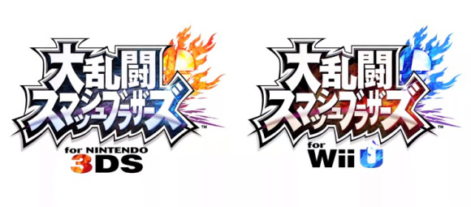
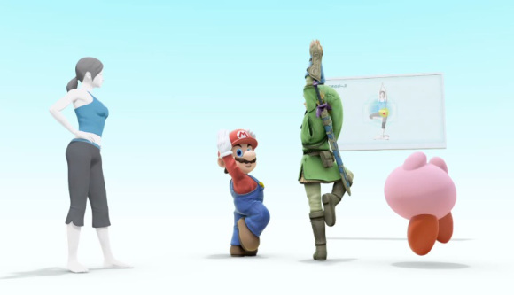

En las últimas semanas, especialmente después del E3, la batalla por el mercado de los videojuegos se ha centrado en la competencia entre Sony y Microsoft...tras el suicidio de marketing de la ùltima compañía (te estoy viendo a ti, X-Box One), la gente se ha olvidado de los clásicos, y es ahí donde aparece Nintendo. A pesar de que uchos dicen que ya no es lo que era antes, en mi opinión personal, sigue presentando juegos bastante buenos, con el simple objetivo de entretenar, y más importante, en vez de enfocarse en un mercado cerrado para los llamados "hardcore" gamers, ha buscado de diferentes formas incorporar a aquellas personas que no son fanáticas de los videojuegos en su mercado, de hecho esta fue la apuesta detrás de la creación del Wii y del Wii U.

Este concepto ha hecho a muchos pensar, erroneamente, que el Wii U y Nintendo están detinados a fracasar miserablemente en el mercado de los videojuegos...pero después de ver los últimos trailers del nuevo Smash Bros, puede que la situación cambie. En un ataque de gráficas HD y nostalgia, Nintendo nos sorprende con tres nuevos trailers en los que incorpora a tres nuevos personajes dentro de la franquicia, la Entrenadora (Trainer) de Wii Fit; Murabito, personaje principal de Animal Crossing; y, el robot con un cañón de plasma integrado, héroe del futuro, Megaman (sí, soy fan!).

De esta forma Nintendo nos demuestra tres cosas, primero que sigue en el juego; dos, que los clásicos nunca pasan de moda; tres, debes respetar a una instructora de yoga, ya que puede patear tu trasero.

Aquí les dejamos los trailers, no olviden dejarnos sus comentarios.

http://www.youtube.com/watch?feature=player_embedded&v=ImQOXr3_YBg

http://www.youtube.com/watch?feature=player_embedded&v=f5JcENj4Lc0#!

http://www.youtube.com/watch?v=Y2kREutnkvE
---

**Note about images**: This post originally contained images that are no longer available and will be replaced with similar images based on the context.

