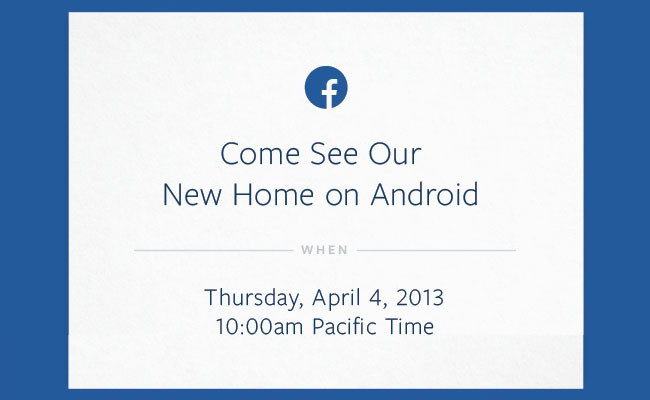

Facebook acaba de invitar a la prensa a un evento en sus oficinas centrales el **4 de abril** y todo lo que nos dice es **"Ven a conocer nuestro nuevo hogar en Android"**. Enigmático lema que ha desatado muchas especulaciones.

Los amigos de [techcrunch](http://techcrunch.com/2013/03/28/facebook-android-phone/) dicen que Facebook creo una versión modificada de Android. Una personalización donde Facebook cobraría protagonismo en el sistema.

Otros rumores incluso dicen que es un celular que sacara HTC en alianza con Facebook.

Todas estas expectativas podrían desaparecer el próximo 4 de abril, puesto que yo apuesto a que es sólo una nueva versión de su aplicación para android, admitámoslo, es muy mala la versión actual que ofrece facebook para android, lo más seguro es que le echaran galleta y presenten finalmente una versión a la altura de la del iPhone.

Finalmente todo son especulaciones, ¿tú qué crees que pase ese día? no olvides dejar tus comentarios

*La imagen de este post fue encontrada en: [Gizmodo](http://gizmodo.com)*
---

**Note about images**: This post originally contained images that are no longer available and will be replaced with similar images based on the context.

