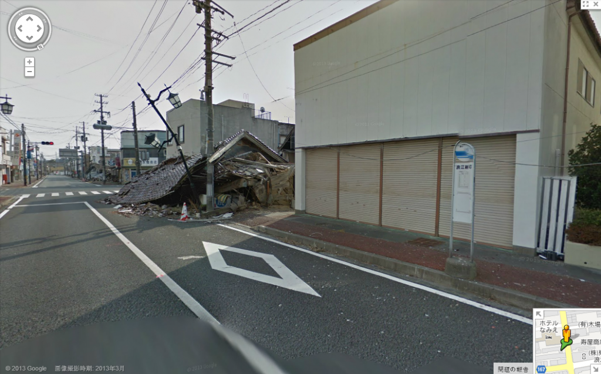

Dos años después de la devastadora** crisis nuclear** en la planta de energía japonesa **en Fukushima Daiichi**, Google Street View nos pone al alcance el explorar una de las ciudades contaminadas por la radiación.

Los famosos coches de Google fueron invitados a fotografiar la ciudad de **Namie** por su alcalde, Tamotsu Baba. Baba y los 21,000 residentes de esta ciudad han sido reubicados a lo largo el país y aun no es posible que regresen a casa puesto que aún existen riesgos de envenenamiento por radiación.

Las fotografías de Google, tomadas a inicios de este mes, revelan una ciudad abandonada con daños por el terremoto y el tsunami que ocasionaron el desastre de Fukushima.

*[Aquí](https://maps.google.com/maps?q=%E8%AB%8B%E6%88%B8%E6%BC%81%E6%B8%AF,+Namie,+Fukushima+Prefecture,+Japan&hl=ja&ie=UTF8&ll=37.492226,140.994447&spn=0.00498,0.009645&sll=37.0625,-95.677068&sspn=38.775203,75.9375&oq=%E8%AB%8B%E6%88%B8&hq=%E8%AB%8B%E6%88%B8%E6%BC%81%E6%B8%AF,&hnear=%E6%97%A5%E6%9C%AC,+%E7%A6%8F%E5%B3%B6%E7%9C%8C%E5%8F%8C%E8%91%89%E9%83%A1%E6%B5%AA%E6%B1%9F%E7%94%BA&t=m&layer=c&cbll=37.492322,140.994431&panoid=9HpmyJMxaCzTMpcBE69eJA&cbp=12,354.02,,0,-1.73&z=17) podrás explorar por tu cuenta la ciudad de Naime vía Google Maps.*

*La imagen de este post fue extraída de: [Google Maps](https://maps.google.com)*
---

**Note about images**: This post originally contained images that are no longer available and will be replaced with similar images based on the context.

